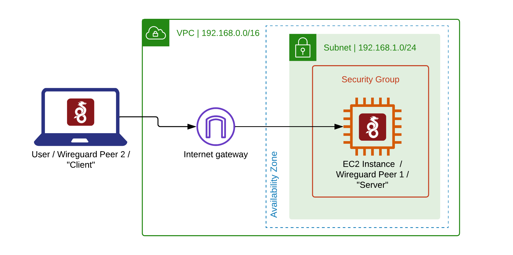

# terraform-wg-aws
Terraform code and wireguard config to create a temporary cloud vpn in AWS using an EC2 instance.

## Purpose
This terraform code (and associated template file containing a bash script) will create an EC2 instance which is running wireguard and can be used as a VPN endpoint.  

> [!NOTE]
> If being used when traveling, the script should ideally be run on a trusted network **before** connecting to a hotel / coffee shop wireless networks.

## Diagram
Here is a simple diagram showing the AWS resources which are created:


## Usage instructions
Obtain the code in the usual way, with ```git clone https://github.com/edrandall-dev/terraform-wg-aws```

Ensure that the AWS CLI and terraform are installed and correctly configured on your local machine (laptop).

> [!NOTE]
> The desired region and other user-definable variables should be set/verified in the ```terraform.tfvars``` file.  Keys are created automatically and should be left blank.

Change to the code directory with ```cd terraform-wg-aws``` and execute ```./start.sh```

The EC2 instance (and associated cloud resources) will be built within AWS.  Keys are automatically created and a "client" configuration will be provided as a terraform output.  This can be pasted into Wireguard VPN client to connect to the VPN.

To tear the environment down (and delete keys from ```terraform.tfvars``` run the ```./stop``` script.)

Under normal operation, there should be no need to connect to the EC2 instance via SSH, and as such no keys are created.  If an SSH connection is needed, EC2 instance connect can be used (via the AWS console) if the following security group rules in ```security.tf``` are uncommented.


```
# SSH access from anywhere
  /*
  ingress {
    from_port = 22
    to_port   = 22
    protocol  = "tcp"
    cidr_blocks = ["0.0.0.0/0"]
  }
  */
  ```

  To do:
   - Do both amd64 and arm64 and have some logic in the instances.tf to figure out which type is being used
  - Move security groups out to separate rules, also do a variable for “insecure_allow_ssh”